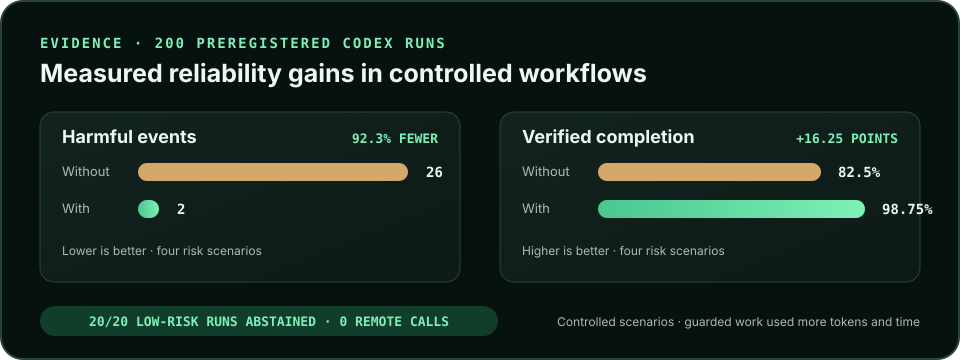

<p align="center">
  
</p>

<h1 align="center">Agent Enhancer Utilities</h1>

<p align="center">
  Add Agent Enhancer to an existing agent workflow for planning, checkpoints,
  deduplication, recovery, and evidence.
</p>

<p align="center">
  <a href="https://liberated.site/status">Service status</a> ·
  <a href="https://liberated.site/effectiveness">Effectiveness</a> ·
  <a href="https://liberated.site/tools">24-module catalog</a> ·
  <a href="https://liberated.site/demo.mp4">Video demo</a> ·
  <a href="https://glama.ai/mcp/connectors/site.liberated/agent-utility-lab">Glama verified</a> ·
  <a href="./LICENSE">MIT license</a>
</p>

> Release `v1.6.0` adds Reliability Sidecar Contract v1, closed
> machine-readable schemas, local and remote checkpoint adapters, and a
> pre-registered paired benchmark. Backend `0.6.9` is live on the existing
> production app with three-tool core and one-tool compact sidecar profiles,
> a fail-closed owned-automation marker, and a clean external-use cutoff. All
> public modules remain free and real USDC remains disabled.

Agent Enhancer is a **reliability sidecar**, not a replacement for the agent or
domain tools you already use. Connect it to an existing workflow and call the
smallest relevant utility only when coordination or failure handling will
materially help.

<p align="center">
  <a href="./docs/EFFECTIVENESS.md">
    
  </a>
</p>

<p align="center">
  <sub>Controlled scenarios, not a universal claim. Guarded risk-bearing runs used more tokens and time. <a href="./docs/EFFECTIVENESS.md">Methodology, raw results, and limitations.</a></sub>
</p>

## Skills

| Skill | Use it for |
| --- | --- |
| `guard-external-plugin-workflows` | Add honest reliability profiles, verification, and recovery around repeated or high-consequence work performed by other plugins |
| `coordinate-parallel-agents` | Locks, deduplication, one-use batons, semaphores, shared rate gates, barriers, and freshness leases |
| `test-http-failure-paths` | Bounded status/failure sequences, webhook delivery attempts, Retry-After behavior, and synthetic fixtures |
| `debug-x402-integrations` | Evidence-linked x402 error diagnosis, requirement drift, and facilitator compatibility checks |
| `review-mcp-tool-contracts` | Tool schema, annotation, capability-handshake, elicitation, and edge-case review |
| `guard-x402-retries` | Detect changed payment requirements and bind one retry identity to one normalized quote |
| `measure-webhook-delivery` | Collect one-use, hash-only evidence about bounded webhook delivery attempts |

Every skill is a small Markdown workflow. Inspect its `SKILL.md` before
installation.

## Sidecar model

Agent Enhancer does not automatically intercept or extend another plugin.
Agents deliberately combine it with domain tools when a workflow is repeated,
parallel, scheduled, quota-sensitive, freshness-sensitive, or vulnerable to
harmful duplicates.

The sidecar coordinates the workflow; the domain plugin still performs and
verifies its own reads, writes, sends, and analysis. See the
[`guard-external-plugin-workflows`](./skills/guard-external-plugin-workflows/SKILL.md)
skill and the vendor-neutral
[Reliability Sidecar Contract v1](./docs/RELIABILITY_SIDECAR_CONTRACT_V1.md)
for the standard lifecycle and guarantee labels.

## Install

List all seven skills before installing:

```sh
npx skills add artiehinz/Agent-Enhancer-Utilities --list
```

GitHub CLI 2.90 or later can preview or install one skill:

```sh
gh skill preview artiehinz/Agent-Enhancer-Utilities coordinate-parallel-agents
gh skill install artiehinz/Agent-Enhancer-Utilities coordinate-parallel-agents
```

For the lowest-overhead reliability path, install only the workflow guard:

```sh
gh skill install artiehinz/Agent-Enhancer-Utilities guard-external-plugin-workflows
```

This skills-first path has no persistent MCP connection. It selects locally,
abstains without network access for ordinary one-time low-risk work, and calls
the public HTTP planner only for risk-bearing work. The release also includes
`agent-enhancer-on-demand-skill.zip`, which expands directly into a Codex
repository's `.agents/skills/` folder and deliberately omits `.mcp.json` and
MCP dependency metadata.

The same repository includes versioned package entry points:

| Host | Entry point | Current evidence |
| --- | --- | --- |
| ChatGPT and Codex | [`.codex-plugin/plugin.json`](./.codex-plugin/plugin.json) | Package validator passed |
| Claude Code | [`.claude-plugin/plugin.json`](./.claude-plugin/plugin.json) | Claude validator passed |
| GitHub Copilot CLI | [`plugin.json`](./plugin.json) | Isolated install found all seven skills |
| Gemini CLI | [`gemini-extension.json`](./gemini-extension.json) | Extension prepared; clean host install remains |
| Generic MCP clients | [`.mcp.json`](./.mcp.json) | Live Streamable HTTP contract passed |

See the exact, deliberately conservative
[compatibility evidence](./docs/COMPATIBILITY.md). A prepared manifest is not a
claim of marketplace approval.

Agents can also connect without installing a skill:

| Surface | Endpoint | Shape |
| --- | --- | --- |
| Progressive MCP (recommended) | `https://liberated.site/mcp?profile=core` | Search, describe, and invoke all 24 modules through three host-visible tools |
| Progressive MCP (full control plane) | `https://liberated.site/mcp` | The core tools plus capability-request and catalog-management tools |
| Claude | `https://liberated.site/mcp/claude` | 37 direct action-specific tools on backend `0.6.0` and later |
| ChatGPT | `https://liberated.site/mcp/chatgpt` | The same release-dependent direct surface |
| HTTP/OpenAPI | `https://liberated.site/v1/openapi.json` | 24 generated module contracts on backend `0.6.0` and later |

All public modules are currently free. Real USDC settlement is disabled.

## Runnable examples

The examples use Python's standard library, synthetic identifiers, and the
public no-auth MCP endpoint:

```sh
python -B examples/reliability-sidecar/run.py
python -B examples/multi-agent-checkpoint/run.py
python -B examples/sidecar-benchmark/test_benchmark.py
python -B examples/sidecar-agent-benchmark/test_benchmark.py
python -B examples/on-demand-sidecar/run.py both
python -B examples/on-demand-agent-benchmark/test_benchmark.py
goose recipe validate examples/goose/agent-enhancer-reliability-sidecar.yaml
```

- The [general sidecar example](./examples/reliability-sidecar/) combines the
  live guard planner with a mock domain agent and proves one searchable record
  survives a replay.
- The [multi-agent checkpoint example](./examples/multi-agent-checkpoint/)
  races two workers, admits one owner, records one synthetic action, and keeps
  `external_proof: false`.
- The [Goose recipe](./examples/goose/) adds the no-auth sidecar to a Goose
  task, stops ambiguous retries, and requires destination read-back before
  recording caller verification.
- The [paired sidecar benchmark](./examples/sidecar-benchmark/) executes five
  deterministic with/without scenarios, publishes 20 pairs per scenario, and
  exposes model-token fields as unavailable rather than inferring savings.
- The [metered Codex tier](./examples/sidecar-agent-benchmark/) freezes the
  same five scenario classes, a condition-blind evaluator, real host token and
  latency capture, five excluded validation pairs, and 20 later publishable
  pairs. Both completed validations are published rather than hidden. Backend
  `0.6.5` reduced harmful events from six to zero and improved verified
  completion from 80% to 90%, but failed both connection-only overhead gates,
  so the publication sample remains blocked. The harness rejects app/MCP
  contamination and keeps cost `null` when the host supplies no defensible
  dollar rate.
- The [skills-first on-demand sidecar](./examples/on-demand-sidecar/) makes no
  remote call for a locally classified low-risk contract and calls the
  existing hosted planner once for risk-bearing work. Local/hosted plan drift,
  raw identifiers, private fields, and unknown tools fail closed. Its new
  preregistered measured-agent validation remains separate from all persistent
  MCP results.
- The [on-demand metered benchmark](./examples/on-demand-agent-benchmark/)
  freezes five paired Codex scenarios, installs only one repo-scoped skill in
  the with condition, rejects every MCP call, measures activation and
  abstention, and blocks publication unless the complete five-pair validation
  passes every fixed gate. The separate 200-run publication sample passed its
  preregistered gates: harmful counters across the four risk scenarios fell
  from 26 to 2 and verified completion rose from 82.5% to 98.75%. The strongest
  result remained overlapping workers, where verified completion improved
  from 8/20 to 19/20. Scheduled refresh improved from 18/20 to 20/20; ambiguous
  create and shared-rate runs were already 20/20 without the sidecar. Guarded
  risk-bearing runs used substantially more tokens and time. All 20 low-risk
  skill runs correctly abstained with zero adapter or remote calls; their lower
  observed token and latency totals are treated as host variance, not product
  savings. See the
  [case study](./docs/ON_DEMAND_BENCHMARK_CASE_STUDY.md) and
  [run-level report](./examples/on-demand-agent-benchmark/results/publication-latest.json).

Remote MCP examples search, describe, and invoke through the progressive
facade. The on-demand prototype uses the public generated HTTP contract only
after local selection. No example copies private backend code or schemas.

## Directory listings

- [Official MCP Registry](https://registry.modelcontextprotocol.io/v0.1/servers?search=site.liberated%2Fagent-utility-lab) — `0.6.4` latest
- [Glama](https://glama.ai/mcp/connectors/site.liberated/agent-utility-lab) — ownership verified
- [Smithery](https://smithery.ai/servers/artemhinz2/Agent-Enhancer-Utilities)

These listings point to the live service. The implementation is not published
in this skills repository.

## Trust

The service publishes:

- current per-module self-test results and dataset freshness at
  [`/status`](https://liberated.site/status);
- privacy-safe methodology and usage evidence at
  [`/effectiveness`](https://liberated.site/effectiveness);
- reproducible run-level sidecar benchmark evidence in
  [`examples/sidecar-benchmark/results/latest.json`](./examples/sidecar-benchmark/results/latest.json);
- preregistered metered Codex evidence in
  [`examples/on-demand-agent-benchmark/results/publication-latest.json`](./examples/on-demand-agent-benchmark/results/publication-latest.json);
- schemas, limits, side effects, retention, and typed errors in the
  [catalog](https://liberated.site/v1/catalog);
- privacy, acceptable-use, security, support, and pricing policies from the
  [service homepage](https://liberated.site).

The skills contain no hidden install telemetry. Do not send credentials,
wallet private keys, personal data, customer records, or conversation history
to the service.

## Repository scope

This public repository contains the reusable skills, their host metadata, and
project-level validation/documentation. The hosted service implementation is
operated separately. A skill must use progressive discovery and must not copy
private schemas, credentials, or backend source.

See the [architecture](./docs/ARCHITECTURE.md),
[CONTRIBUTING.md](./CONTRIBUTING.md), [SECURITY.md](./SECURITY.md), and
[effectiveness methodology](./docs/EFFECTIVENESS.md). The product direction
and planned cross-plugin reliability work are described in
[docs/ROADMAP.md](./docs/ROADMAP.md). The proposed read-only planning contract
is in
[docs/WORKFLOW_GUARD_PLANNER.md](./docs/WORKFLOW_GUARD_PLANNER.md), the bounded
checkpoint contract is in
[docs/OPAQUE_WORKFLOW_CHECKPOINTS.md](./docs/OPAQUE_WORKFLOW_CHECKPOINTS.md),
and current live primitive evidence is recorded in
[docs/SIDECAR_RECIPE_TESTS.md](./docs/SIDECAR_RECIPE_TESTS.md).
The exact open-source contribution sequence and module map are in
[docs/OPEN_SOURCE_INTEGRATION_PLAN.md](./docs/OPEN_SOURCE_INTEGRATION_PLAN.md).

## License

MIT
